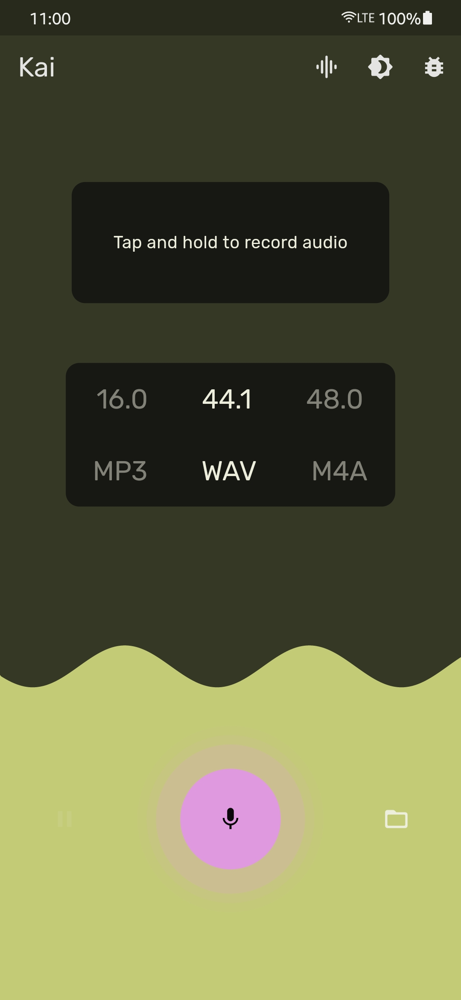
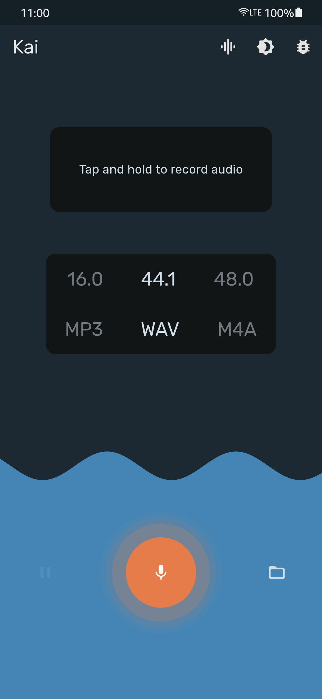
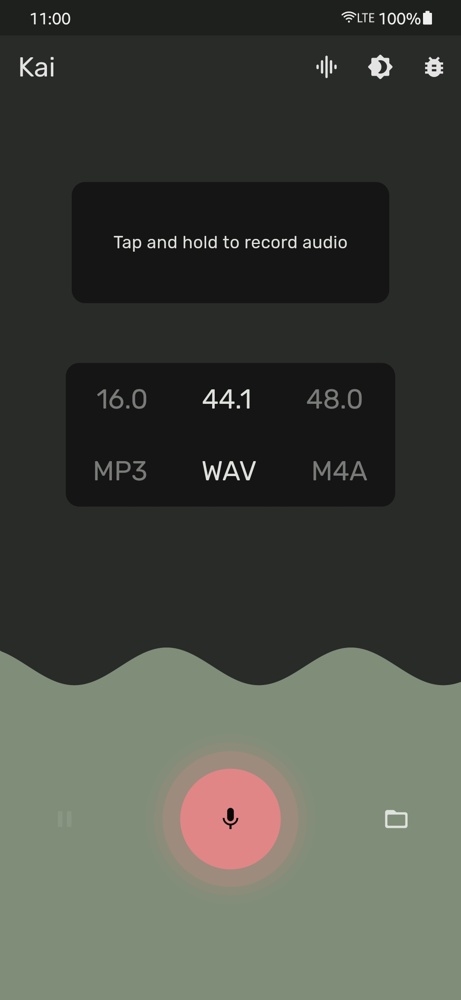
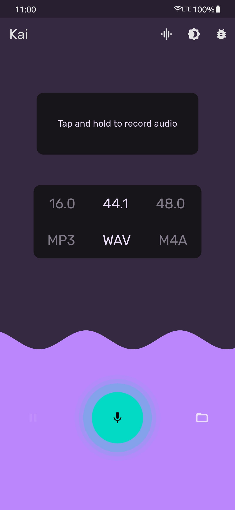
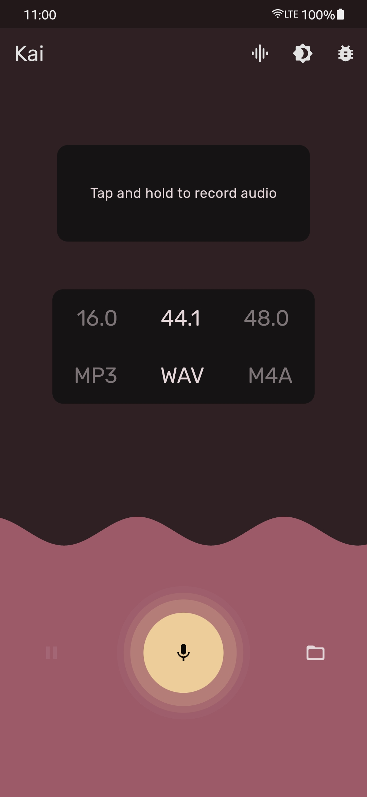
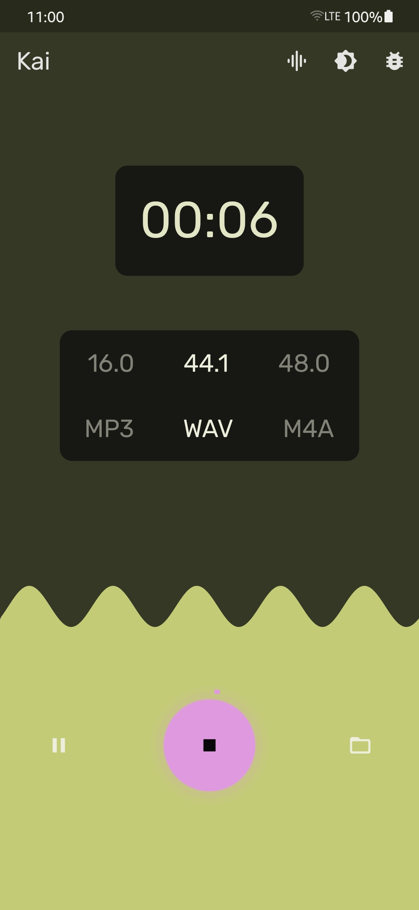
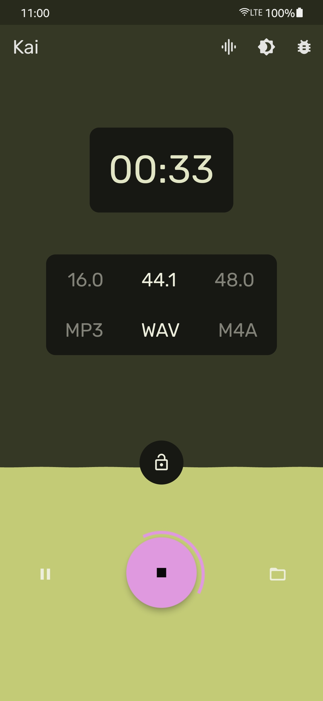
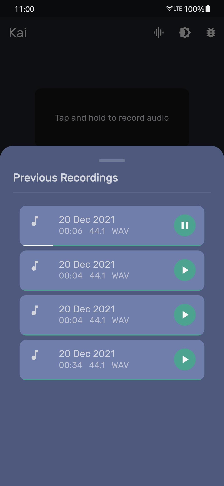
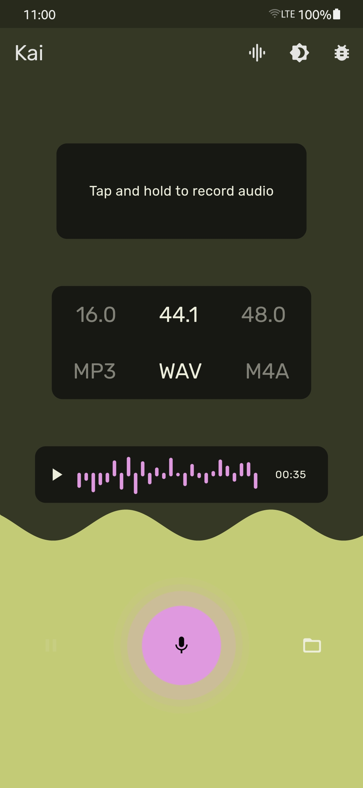
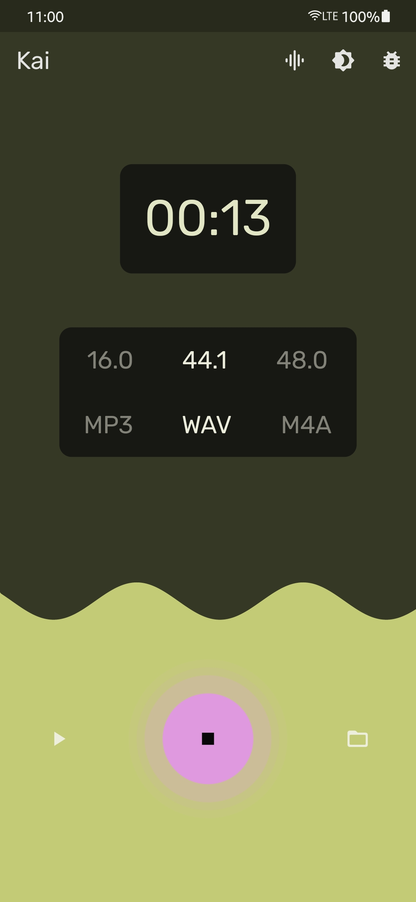

<h1 align="center" style="border-bottom: none">
    <b>
        <p>Qoohoo Submission</p><br>
    </b>
    🎙️ An audio recording/playing app. 🎙️ <br>
</h1>

<p align="center">
<a href="https://flutter.dev/"></a>
<a href="https://github.com/codenameakshay/kai-qoohoo"></a>
<a href="https://github.com/codenameakshay/kai-qoohoo"></a>
<a href="https://github.com/codenameakshay/kai-qoohoo"></a>

</p>

<p align="center">
This is a basic audio recording app, which is developed using Flutter.
</p>


## Screenshots

| Record Screen (Default theme) 	| Record Screen (Theme #2) 	| Record Screen (Theme #3) 	| Record Screen (Theme #4) 	| Record Screen (Theme #5) 	|
|--------------	|--------------	|--------------	|--------------	|--------------	|
|   |  	|   	|    	|   	|

| Recording 	| Tap & Hold Lock 	| Previous Recordings 	| Last Recording 	| Paused 	|
|--------------	|--------------	|--------------	|--------------	|--------------	|
|   |  	|   	|    	|   	|

More screenshots are available in the `/screenshots` folder.
## Features

 - Record high quality audio
 - Quick record with long press
 - Pause and resume recording (API 24+ (Nougat & above) only)
 - Record in various file formats (.mp3, .wav, .m4a)
 - Record in various sampling rates (16, 44.1, 48)
 - Currently records only in 128kbps sampling rate for less size files
 - Play last recording easily in one-tap
 - View all previous recordings
 - Play any of the recording
 - Smooth animations and haptic feedback
 - Visualise amplitude in real-time
 - Has support for 40+ themes

## Permissions

Kai requires only these three permissions:
 - `[INTERNET]` To access the internet for downloading the fonts (Rubik from Google Fonts). App works without internet too.
 - `[MICROPHONE]` To record audio (needed).
 - `[WRITE_EXTERNAL_STORAGE]` To save the audio file, app accesses application documents folder and no other folder is visible (Scoped storage), works if denied too.
## Built With

* [Flutter](https://flutter.dev/)
* [Dart](https://dart.dev/)

## Getting Started

To build on MacOS or Windows, please follow these simple steps.

**Step 1:**

```shell
git clone https://github.com/codenameakshay/kai-qoohoo.git
```

**Step 2:**

Follow the instructions [here](https://developer.android.com/studio) to install Android Studio. Then you're ready to build the app.

For testing the app you can create an emulator following the steps [here](https://developer.android.com/studio/run/emulator), or directly run on a physical Android device.

**Step 3:**

Follow the instructions [here](https://flutter.dev/docs/get-started/install) to install Flutter. As Odin uses the `stable` channel, you need to switch the channel if you are on `dev` or `beta` channels. Just type:

```shell
flutter channel stable
```

**Step 4:**

You should generate the necessary code first.
```shell
flutter pub run build_runner build --delete-conflicting-outputs
```

**Step 5:**

To run the app just type these commands in terminal or use the Run and Debug option from your editor of choice.
```shell
flutter pub get
flutter run
```

## Code Walkthrough

### Folder Structure

The folder structure is explained below.

```
lib (All flutter code in present here)
 ┃
 ┣ constants (Various constant values used throughout the app)
 ┃
 ┣ controllers (All the controllers/notifiers used in the app)
 ┃
 ┣ pages (All the UI pages in the app)
 ┃
 ┣ painters (All the custom painters used in the app)
 ┃
 ┣ router (All the routes used in the app)
 ┃
 ┣ services (All the services used in the app)
 ┃
 ┣ utils (All reusable code (functions, classes, etc.) used in the app)
 ┃
 ┗ widgets (All the widgets used in the app)
 ```

```
lib
 ┃
 ┣ constants
 ┃ ┣ app_color.dart (App color constants)
 ┃ ┗ app_data.dart (App data constants such as device size)
 ┃
 ┣ controllers
 ┃ ┣ audio_player_controller.dart (Audio player controller)
 ┃ ┣ path_controller.dart (Path controller)
 ┃ ┣ record_controller.dart (Recording controller)
 ┃ ┣ settings_controller.dart (Settings controller)
 ┃ ┣ theme_controller.dart (Theme controller)
 ┃ ┣ timer_controller.dart (Timer controller to check recording duration)
 ┃ ┗ waveform_controller.dart (Waveform controller, to plot amplitude waveform)
 ┃
 ┣ pages
 ┃ ┣ home_page.dart (The default home page, which consists of app bar and body)
 ┃ ┣ loading_page.dart (A loading page is shown for data loading)
 ┃ ┗ record_page.dart (The main body of the app, which consists of recording, playback, and settings)
 ┃
 ┣ painters
 ┃ ┣ audio_waveform_painter.dart (Painter to draw the waveform, not in use)
 ┃ ┣ ripple_painter.dart (Painter to draw the ripple effect behind record button)
 ┃ ┗ wave_painter.dart (Painter to draw the waveform of the amplitude + animations)
 ┃
 ┣ router
 ┃ ┣ app_router.dart (Define routes inside the app)
 ┃ ┣ app_router.gr.dart (Generated file)
 ┃ ┣ route_observer.dart (Define route observer to get current route stack, and debug)
 ┃ ┗ transition_route_builders.dart (Animations which happen on route transition)
 ┃
 ┣ services
 ┃ ┣ locator.dart (Service locator, using get_it package to register notifiers and services)
 ┃ ┣ logger.dart (Logger service, which logs errors, infos or any warnings)
 ┃ ┣ product_service.dart (Product service, which handles all product related operations like fetching them)
 ┃ ┣ theme_pref_service.dart (Theme preference service, which handles the theme preference, and change theme)
 ┃ ┣ theme_service.dart (Theme service, which handles the theme, and change theme)
 ┃ ┗ transaction_service.dart (Transaction service, which handles all stock record related operations like fetching, updating them)
 ┃ ┣ audio_player_service.dart
 ┃ ┣ locator_service.dart (Service locator, using get_it package to register notifiers and services)
 ┃ ┣ logger_service.dart (Logger service, which logs errors, infos or any warnings)
 ┃ ┣ path_service.dart (Path service, which handles all path related operations like fetching docs, etc.)
 ┃ ┣ record_service.dart (Recording service, which handles all recording related operations)
 ┃ ┣ settings_service.dart (Settings service, which handles all settings, currently handles only graph style)
 ┃ ┣ snackbar_service.dart (Snackbar service, which handles all snackbars)
 ┃ ┣ theme_pref_service.dart (Theme preference service, which handles the theme preference, and change theme)
 ┃ ┣ theme_service.dart (Theme service, which handles the theme, and change theme)
 ┃ ┣ timer_service.dart (Timer service, which handles all timers which are used for recording duration, amplitude waveform, etc.)
 ┃ ┗ waveform_service.dart (Waveform service, which handles all waveform related operations, currently not in use)
 ┃
 ┣ utils
 ┃ ┗ smoothing.dart (A filter to smooth out the amplitude waveform matrix)
 ┃
 ┣ widgets
 ┃ ┣ amplitude_widget.dart (Widget to draw the amplitude waveform)
 ┃ ┣ audio_waveform_widget.dart (Widget to draw the waveform, not in use)
 ┃ ┣ bug_report_button.dart (Button to send bug reports)
 ┃ ┣ directory_button.dart (Widget to display the directory button)
 ┃ ┣ directory_sheet.dart (Widget to display the directory sheet)
 ┃ ┣ format_settings.dart (Widget to display the format settings)
 ┃ ┣ last_recording_bubble.dart (Widget to display the last recording bubble)
 ┃ ┣ pause_button.dart (Widget to display the pause button)
 ┃ ┣ realistic_graph_button.dart (Widget to display the realistic graph button)
 ┃ ┣ recording_card.dart (Widget to display the recording card in directory sheet)
 ┃ ┣ record_button.dart (Widget to display the record button)
 ┃ ┣ record_duration.dart (Widget to display the recording duration)
 ┃ ┗ scrollable_bottom_sheet.dart (Widget to display the bottom sheet i.e. used in directory sheet)
 ┃
 ┣ generated_plugin_registrant.dart (Generated file for plugins)
 ┗ main.dart (Main file, which is the entry point of the app, used for registering theme, providers, routes, etc.)
 ```

### Packages Used

All the different packages used throughout the app, with thier explanations.
- `animations: ^2.0.2` - Used for animations during page/route transitions
- `auto_route: ^3.2.0` - Used to generate routes automatically
- `device_info_plus: ^3.2.0` - Used to get device info for bug reports
- `flex_color_scheme: ^4.1.1` - Used for theming
- `flutter_archive: ^4.1.0` - Used for creating zip file for logs
- `flutter_mailer: ^2.0.1` - Used for sending bug reports via email
- `get_it: ^7.2.0` - Used for state management
- `google_fonts: ^2.1.0` - Used for Rubik font
- `intl: ^0.17.0` - Used to format date and time
- `just_audio: ^0.9.18` - Used to play audio recordings
- `just_waveform: ^0.0.1` - Used to show audio waveform
- `linalg: ^0.4.0` - Used to solve matrix for smoothing filter
- `logger: ^1.1.0` - Used to log errors, info or warnings
- `path_provider: ^2.0.8` - Used to get application directory path to save audio files
- `provider: ^6.0.1` - Used for state management
- `record: ^3.0.2` - Used to record and save audio
- `rxdart: ^0.27.3` - Used to create streams
- `shared_preferences: ^2.0.11` - Used to save theme preference
- `sprung: ^3.0.0` - Usedd for dampening the animations

Dev dependencies -
- `auto_route_generator: ^3.1.0` - Used for generating routes
- `build_runner: ^2.1.7` - Used to generate necessary code
## Releases

Please see the [releases tab](https://github.com/codenameakshay/kai-qoohoo/releases) for more details about the latest release.

## Contributing
First off, thanks for visiting this repo and taking your time to read this doc.
Any contributions you make are **greatly appreciated**.

If you'd like to propose a feature, submit an issue [here](https://github.com/codenameakshay/kai-qoohoo/issues).

## License

Distributed under the GPL-3.0 License. See `LICENSE` for more information.

## Contributers

<a href="https://github.com/codenameakshay/kai-qoohoo/graphs/contributors">
  
</a>

### If you made it here, thanks for your support. You can show more support by starring this repo. See ya! 👋